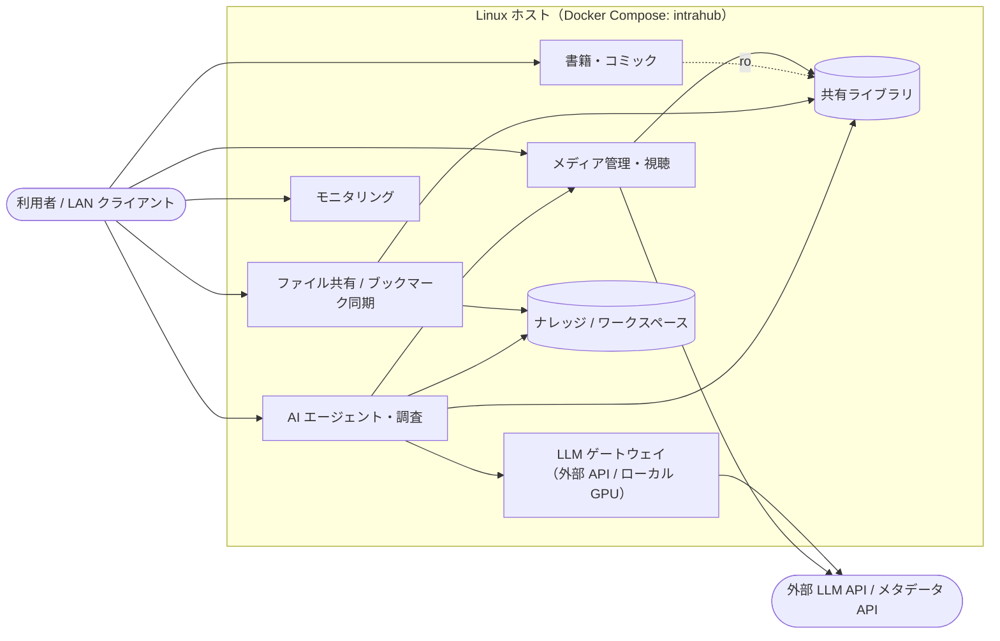

# IntraHub

メディア管理とAIサービスを1台のLinuxホストで動かすDocker Compose構成です。設定はルートの`.env`へ集約し、DNS・TLS・Caddy等のリバースプロキシは利用者側で管理します。

## 構成図



各サービスのデータは専用のデータベースへ保存し、DBはいずれも`internal: true`のネットワークに閉じてホストへ公開しません。公開ポートの待受アドレスは`.env`の`BIND_ADDRESS`（既定`127.0.0.1`）で決まり、`mediavault-mcp`のみ`MCP_BIND_ADDRESS`（既定`0.0.0.0`）です。

## できること

### メディアの管理と視聴

MediaVaultのWeb UIから、共有ライブラリのメディアを登録・検索・閲覧できます。外部メタデータAPIと連携して情報を補完します。同じライブラリの動画・音楽はJellyfinでストリーミング再生でき、Jellyfin側はライブラリをread-onlyで参照します。

`http://127.0.0.1:8080`（MediaVault）／`http://127.0.0.1:8096`（Jellyfin）

### 書籍・コミックの閲覧

BookOrbitで書誌情報の管理と検索を行い、cbz/cbr/cb7のコミックは組み込みリーダーでそのまま閲覧できます。初回アクセス時は`SETUP_BOOTSTRAP_TOKEN`を使ったセットアップウィザードで管理者アカウントを作成します。共有ライブラリはread-onlyで参照します。

`http://127.0.0.1:3000`

### LANからのファイル共有

Sambaが共有ライブラリを`Library`、ナレッジ領域を`Knowledge`としてread-writeで公開します。Web UIを介さずに、LANのクライアントからファイルを直接追加・整理できます。

`smb://127.0.0.1/Library`、`smb://127.0.0.1/Knowledge`（:445）

### ブックマークの同期

Basic認証付きのWebDAVサーバーでブックマークデータを保存・同期します。認証情報は`.env`の`BOOKMARKS_USER`と`BOOKMARKS_PASSWORD`で設定します。

`http://127.0.0.1:8082`

### LLMの共通入口

LiteLLMが`anthropic`、`openai`、`vllm`という論理モデル名でOpenAI互換APIを提供します。AIサービス側は`MASTRA_LLM_MODEL`などの`*_LLM_MODEL`の値を変えるだけで、外部APIとローカル推論を切り替えられます。`compose.vllm.yaml`を追加するとNVIDIA GPU上のvLLMが起動し、論理モデル名`vllm`の実体になります。

`http://127.0.0.1:4000/v1`

### AIエージェントによる処理

Mastraでエージェントとワークフローを実行し、Hermes Agentがバックグラウンドで常時処理を進めます。どちらも共有ライブラリとナレッジ／ワークスペースをread-writeで扱い、LiteLLM経由でLLMを、MediaVaultの内部API経由でメディア情報を利用します。利用できるエージェントやワークフローはMastraアプリ側に実装されたものに限ります。

`http://127.0.0.1:4111`（Mastra。Hermesはホストへ公開しません）

### AIクライアントからのライブラリ参照（MCP）

MediaVault MCPが`search_library`、`get_item_context`、`get_item_text`のRead OnlyツールをBearerトークン付きで公開します。Mastraのエージェントに加えて、外部のAIクライアントからもライブラリを検索・参照できます。

`http://<host>:8081`（`MCP_AUTH_TOKEN`で認証）

### 長時間の調査（拡張）

`compose.research.yaml`を追加するとOpen Deep Researchが有効になり、LLMと検索APIを使った長時間の調査処理を実行して、結果をワークスペースへ出力します。

`http://127.0.0.1:8000`

### モニタリング

Netdataがホスト、Dockerコンテナ、NVIDIA GPUのメトリクスを収集して可視化します。GPU監視にはホストのNVIDIA driverとContainer Toolkitが必要です。ダッシュボードはインターネットへ直接公開しないでください。

`http://127.0.0.1:19999`

## 起動

```sh
cp .env.example .env
$EDITOR .env
docker compose config --quiet
docker compose up -d
```

`.env`の空欄になっているpassword、token、API key、`<model-id>`を実値へ変更してください。秘密値は必要に応じて`openssl rand -hex 32`などで生成します。`.env`はGit管理外とし、Linuxでは`chmod 600 .env`を設定します。

## 拡張

```sh
# vLLM
docker compose -f compose.yaml -f compose.vllm.yaml up -d

# Research
docker compose -f compose.yaml -f compose.research.yaml up -d

# vLLM＋Research
docker compose -f compose.yaml -f compose.vllm.yaml -f compose.research.yaml up -d
```

すべての永続データは`.env`の`*_SOURCE`で保存先を選択します。テンプレートの既定値はnamed volume、`/mnt/library`のような絶対パスはbind mountです。bind mountを使う場合は、起動前にホスト側ディレクトリと書込み権限を用意します。

## サービス早見表

| 機能 | 主なコンテナ | ポート | 有効化 |
| --- | --- | --- | --- |
| メディア管理 | `mediavault-web` | 8080 | 標準 |
| メディア参照（MCP） | `mediavault-mcp` | 8081 | 標準 |
| メディア再生 | `jellyfin` | 8096 | 標準 |
| 書籍・コミック | `bookorbit-app` | 3000 | 標準 |
| ファイル共有 | `samba` | 445 | 標準 |
| ブックマーク同期 | `bookmarks` | 8082 | 標準 |
| LLMゲートウェイ | `litellm` | 4000 | 標準 |
| AIエージェント | `mastra` | 4111 | 標準 |
| モニタリング | `netdata` | 19999 | 標準 |
| バックグラウンド処理 | `hermes-agent` | 非公開 | 標準 |
| ローカル推論 | `vllm` | 非公開 | `compose.vllm.yaml` |
| 調査 | `open-deep-research` | 8000 | `compose.research.yaml` |

`mediavault-api`、各サービスのPostgreSQL／Redisはホストへ公開しません。Caddyは上表の対象外で、必要な場合だけ`reverse-proxy/caddy`の別Composeとして起動します。

サービス別の補足は`services/<name>/README.md`を参照してください。実環境固有のパス、DNS、リバースプロキシ、バックアップ手順はデプロイ先のリポジトリで管理します。

Caddyを前段へ置く場合は、HTTP基本構成とTLS/Cloudflare拡張を分けた[reverse-proxy/caddy](./reverse-proxy/caddy/README.md)を利用できます。CaddyはIntraHub本体のComposeには含まれません。
