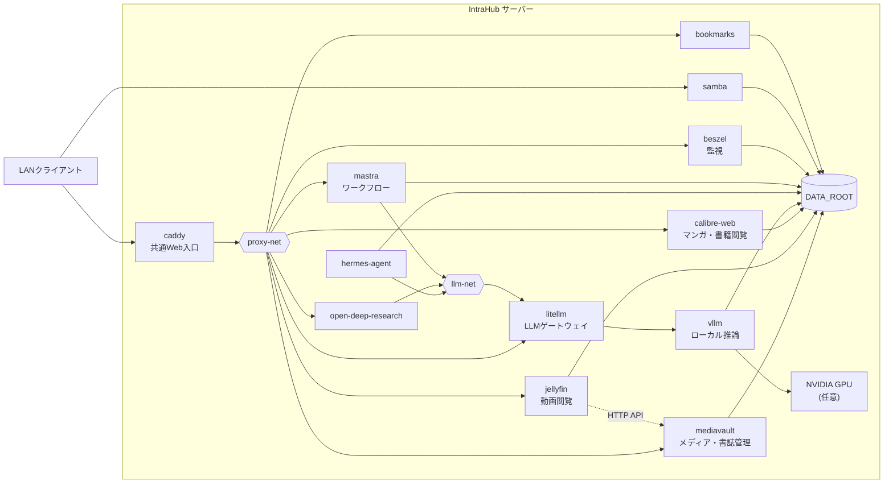

# IntraHub

メディア・書誌を管理する **MediaVault** 系と、LLM・エージェントを動かす **KnowledgeHub** 系を、共有ネットワークとHTTP APIだけで疎結合させて1台のサーバー上に同居させる Docker Compose 構成。

## このリポジトリについて

個人の自宅サーバー1台分の構成をそのまま公開したもので、**クローンして `docker compose up` しても完走しない**。

| 理由 | 内容 |
|---|---|
| 自作アプリのイメージが private | `mediavault` と `mastra` は GHCR のプライベートパッケージを参照する。第三者は pull できない |
| 一部サービスに Compose 定義が無い | `jellyfin` / `calibre-web` は Caddy に vhost だけがある |
| 実環境値を一切持たない | FQDN・IP・ホストパスをリポジトリに書かない方針のため、`.env` を自分の環境で埋めないと起動しない |

構成そのものと、Compose の分割・設計書の書き方の参考として読めることを目的にしている。

## 構成



## サービス一覧

| サービス群 | サービス | 責務 | 設計書 |
|---|---|---|---|
| 基盤 | Caddy | HTTP/HTTPSの共通入口、TLS終端 | [services/caddy/](./services/caddy/README.md) |
| MediaVault | MediaVault | メディア・書誌・ファイル管理（api / web / PostgreSQL） | [services/mediavault/](./services/mediavault/README.md) |
| KnowledgeHub | Mastra | Wiki生成などのエージェント・ワークフロー | [services/mastra/](./services/mastra/README.md) |
| KnowledgeHub | vLLM | ローカルLLM推論。GPUを専有する | `services/vllm/` |
| KnowledgeHub | LiteLLM | 役割別モデルのルーティングとフォールバック | `services/litellm/` |
| KnowledgeHub | Hermes-Agent | 対話エージェント（専用 PostgreSQL を含む） | `services/hermes-agent/` |
| KnowledgeHub | Open Deep Research | 調査ワークフロー（専用 Redis / PostgreSQL を含む） | `services/open-deep-research/` |
| 監視 | Beszel | リソース監視（hub / agent） | `services/monitoring/` |
| 共有 | Samba | SMB共有（メディア原本、Obsidian Vault） | `services/samba/` |
| 共有 | Bookmarks | ブックマーク同期用のWebDAV | `services/bookmarks/` |

リンクになっていないものは `compose.yaml` だけがあり、設計書が未整備（[既知の未整備](#既知の未整備)）。

## 設計方針

**実環境値を持たない。** FQDN・IP・ホストパス・UID・公開ポートをリポジトリのどこにも書かず、すべて `.env` の変数で受ける。逆に、環境で変わらない値（コンテナ内パス、コンテナ名と内部ポート、共有ネットワーク名、イメージ名とタグ）は変数にせずリテラルで書く。同じ値の実体が2箇所に存在しない状態を保つ。

**サービス設計書とコンテナ設計書を分ける。** `services/<name>/README.md` がサービス契約（コンテナ構成・ネットワーク・入力変数・公開の組み立て規則・確認の合格条件）を持ち、`services/<name>/<container>.md` がコンテナ起動契約（イメージ・タグ・内部ポート・コンテナ内パス・環境変数・実行制約）を持つ。何が変わったときにその記述が変わるかで振り分ける。コンテナ設計書のファイル名は compose の `services:` のキーと一致させる。

**自作アプリをこのリポジトリでビルドしない。** ソースを持つリポジトリの CI がイメージを GHCR へ publish し、ここは `image:` でバージョンを固定して pull するだけとする。`build:` を持つのは Caddy だけで、これは公開イメージへ DNS プロバイダを組み込むための再ビルドであり、アプリのビルドではない。

Compose はルートの `compose.yaml` が `include:` で各サービスを束ね、`intrahub` という単一プロジェクトとして起動する。サービスを追加するときは `services/<name>/compose.yaml` を作り、`include:` に1行足す。

## 前提環境

### サーバー

| 項目 | 要件 |
|---|---|
| OS | Docker Engine と Compose v2 が動く Linux |
| データ領域 | 書き込み可能なパス1つ（`DATA_ROOT`）。配下に各サービスの永続データを作る |
| ネットワーク | LANから到達できること。HTTP/HTTPS の2ポートをホストで占有できること |
| GPU | 任意。vLLM を動かす場合のみ NVIDIA GPU と Container Toolkit が必要 |

### クライアント

LAN内の端末。サービスごとに使うものが違う。

| 手段 | 使うサービス |
|---|---|
| ブラウザ | MediaVault、Jellyfin、Calibre-Web、Beszel、Open Deep Research |
| SMBクライアント | Samba 共有（ファイル配置、Obsidian Vault） |
| ブラウザ拡張（Floccus 等） | Bookmarks（WebDAV） |
| OpenAI互換クライアント | LiteLLM |

### 外部

| 項目 | 要件 |
|---|---|
| ドメイン | 権威DNSを Cloudflare に置いた実在ドメイン1つ（`BASE_DOMAIN`） |
| APIトークン | 上記ゾーンの `Zone:Read` と `DNS:Edit` を許可した Cloudflare トークン |
| LAN内DNS | `*.${BASE_DOMAIN}` を IntraHub サーバーのアドレスへ返すこと |

証明書は DNS-01 チャレンジで取得するため、**サーバーが外部から到達可能である必要はない**。公開DNSにLAN内のA/AAAAレコードを置く必要もない。

## 起動

```bash
# 1. 入力変数を用意する
cp .env.example .env
$EDITOR .env

# 2. すべての必須変数が解決することを確認する
docker compose config >/dev/null

# 3. 共有ネットワークを作る（初回のみ）
docker network create proxy-net
docker network create llm-net
docker network create ai-net

# 4. GHCR のプライベートパッケージを引けるようにする（初回のみ）
docker login ghcr.io

# 5. DATA_ROOT 配下の永続化ディレクトリを用意し、所有権をコンテナ実行UIDに合わせる

# 6. 起動する
docker compose up -d
```

複数のサービスをまたぐネットワーク（`proxy-net` / `llm-net` / `ai-net`）は各 `compose.yaml` で `external: true` として参照するため、起動前に外部で作る必要がある。サービス内部に閉じるネットワーク（`db-net` など）は Compose が自動で作る。

`ai-net` の作成を忘れると vLLM と LiteLLM が繋がらず、LiteLLM のフォールバックだけが動く紛らわしい状態になる。起動前に `docker network ls` で3つ揃っていることを確認する。

vLLM は初回のモデル取得とコンパイルに時間がかかるため、`docker compose up -d vllm litellm` を先行させ、`docker compose logs -f vllm` で完了を確認してから残りを起動するとよい。

## 自作サービスの実装

自作アプリのソースコードは別リポジトリで管理する。**イメージはアプリリポジトリの CI が GHCR へ publish し、本リポジトリはバージョンを固定して pull するだけとする。**本リポジトリでアプリをビルドしない。

| リポジトリ | 発行するイメージ |
|---|---|
| `intrahub-mediavault` | `ghcr.io/aoton0029/intrahub-mediavault-api`、`ghcr.io/aoton0029/intrahub-mediavault-web` |
| `intrahub-mastra` | `ghcr.io/aoton0029/intrahub-mastra` |

| 対象 | 規則 |
|---|---|
| イメージ名 | `ghcr.io/<owner>/intrahub-<name>` |
| タグ | SemVer。`compose.yaml` にリテラルで書く。`:latest` も可変タグも使わない |
| 発行の契機 | アプリリポジトリで `v*` タグを push したとき |
| 付けるタグ | SemVer と commit SHA の両方。compose が固定するのは SemVer |

いずれもプライベートパッケージなので、サーバー側で `read:packages` 権限のトークンによる `docker login ghcr.io` が一度必要になる。

## 秘密情報

APIキー・パスワードの実値は `.env` と `services/bookmarks/config.yml` にのみ置く。いずれも `.gitignore` 対象で、本リポジトリのどの文書にも実値を書かない。書くのは変数名・用途・格納先だけとする。

作業ツリーに実環境値が混入していないことは以下で検査できる。

```bash
# 実FQDN・実IP・実ホストパスの混入
grep -rnE '[0-9]+\.[0-9]+\.[0-9]+\.[0-9]+|\.(win|lan|local)\b' . --exclude-dir=.git

# ホスト側マウント元が変数で受けられているか（左辺がリテラルの絶対パスなら混入）
grep -rnE '^\s+- +/' --include='compose.yaml' .
```

コンテナ内パス（マウントの右辺、`STORAGE_ROOT` のようなコンテナ内設定）は環境依存値ではないので、絶対パスのリテラルでよい。

## 既知の未整備

| 対象 | 内容 |
|---|---|
| 設計書 | `vllm` / `litellm` / `hermes-agent` / `open-deep-research` / `monitoring` / `samba` / `bookmarks` は `compose.yaml` だけがあり、サービス設計書とコンテナ設計書が無い |
| イメージのタグ | `dockurr/samba` / `hacdias/webdav` / `henrygd/beszel` / `henrygd/beszel-agent` / `tecnativa/docker-socket-proxy` はタグを固定していない |
| イメージタグの変数化 | `LITELLM_IMAGE_TAG` と `ODR_IMAGE_TAG` を入力変数で受けている。イメージタグは環境依存値ではないので `compose.yaml` のリテラルへ移すべき |
| Compose 定義の欠落 | `jellyfin` / `calibre-web` / `mediavault-mcp` は Caddy に vhost があるが Compose 定義が無い |
| 未実装のコンテナ | `mediavault-worker` と `mediavault-mcp` は実装が無いため `services/mediavault/compose.yaml` 内でコメントアウトしている |
| GHCR のイメージ | `intrahub-mediavault` と `intrahub-mastra` はまだタグを打っておらず、GHCR にイメージが無い |
| healthcheck | `mediavault-api` の healthcheck は `GET /api/health` の1本で liveness と readiness を兼ねている |
| データ配置 | `samba` / `bookmarks` / `hermes-agent` のマウントパスが他サービスのパス体系と揃っていない |
