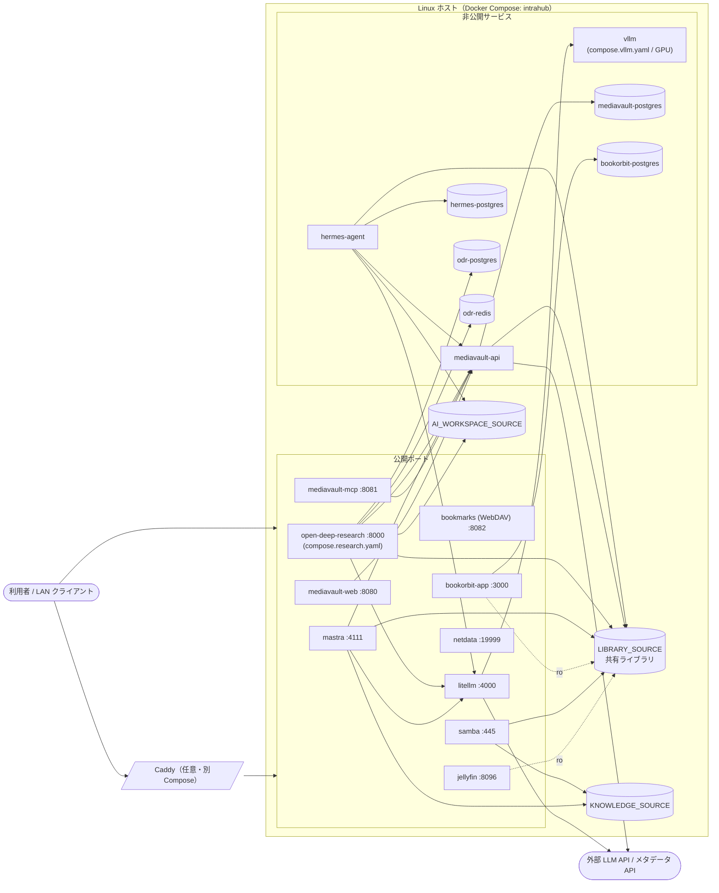

# IntraHub

メディア管理とAIサービスを1台のLinuxホストで動かすDocker Compose構成です。設定はルートの`.env`へ集約し、DNS・TLS・Caddy等のリバースプロキシは利用者側で管理します。

## 構成図



DB・Redisは`internal: true`のネットワークに閉じ、`litellm`／`mediavault-api`へは`llm-api`／`mediavault-api`ネットワーク経由でのみ到達します。公開ポートの待受アドレスは`.env`の`BIND_ADDRESS`（既定`127.0.0.1`）で決まり、`mediavault-mcp`のみ`MCP_BIND_ADDRESS`（既定`0.0.0.0`）です。

## コンテナの機能・役割

### 標準構成

| コンテナ | 機能・役割 | 公開・主な接続先／データ |
| --- | --- | --- |
| `mediavault-web` | MediaVaultのWeb UIを提供するフロントエンド | `:8080`で公開。`mediavault-api`へ接続 |
| `mediavault-api` | メディア情報、ライブラリ操作、外部メタデータAPI連携を担うMediaVaultの内部API | ホストへ非公開。`mediavault-postgres`、共有ライブラリ、MediaVaultストレージを使用 |
| `mediavault-mcp` | AIクライアント向けにMediaVaultの検索・参照機能をMCPとして公開 | `:8081`で公開しBearerトークンで認証。`mediavault-api`へ接続 |
| `mediavault-postgres` | MediaVaultのメタデータを永続化する専用PostgreSQL | ホストへ非公開。`media-db`内部ネットワークに限定 |
| `jellyfin-data-init` | Jellyfinの設定・キャッシュ領域を実行UID/GIDで利用できるよう所有者を設定 | 初期化完了後に終了 |
| `jellyfin` | 共有ライブラリの動画・音楽などを配信・再生するメディアサーバー | `:8096`で公開。共有ライブラリはread-only |
| `bookorbit-app` | 書籍・コミックの管理、検索、Webリーダーを提供 | `:3000`で公開。`bookorbit-postgres`へ接続し、共有ライブラリはread-only |
| `bookorbit-postgres` | BookOrbitの書誌情報やアプリデータを永続化するpgvector対応PostgreSQL | ホストへ非公開。`bookorbit-db`内部ネットワークに限定 |
| `samba` | 共有ライブラリとナレッジ領域をLANクライアントへSMB共有 | `:445`で公開。`Library`と`Knowledge`をread-writeで共有 |
| `bookmarks` | ブックマークデータを保存・同期するWebDAVサーバー | `:8082`で公開しBasic認証を使用。データ領域を`/data`へ永続化 |
| `litellm` | 外部LLMと任意のvLLMを共通のOpenAI互換API・論理モデル名で中継 | `:4000`で公開。AIサービスから`llm-api`経由で利用 |
| `mastra-data-init` | Mastraのデータ領域を実行UID/GIDで利用できるよう所有者を設定 | 初期化完了後に終了 |
| `mastra` | LLMエージェントとワークフローを実行し、ライブラリやナレッジを処理 | `:4111`で公開。LiteLLM、MediaVault API/MCPへ接続し、ライブラリとナレッジ領域をread-writeで使用 |
| `hermes-agent` | バックグラウンドでAIエージェント処理を行う内部ワーカー | ホストへ非公開。LiteLLM、MediaVault API、`hermes-postgres`へ接続し、ライブラリとAIワークスペースをread-writeで使用 |
| `hermes-postgres` | Hermes Agentの状態や履歴を永続化する専用PostgreSQL | ホストへ非公開。`hermes-db`内部ネットワークに限定 |
| `netdata` | Linuxホスト、Dockerコンテナ、NVIDIA GPUのメトリクスを収集・可視化 | `:19999`で公開。ホストPID、Docker socket、`/proc`、`/sys`を監視目的で参照 |

### 拡張構成

| コンテナ | 有効化 | 機能・役割 | 公開・主な接続先／データ |
| --- | --- | --- | --- |
| `vllm-init` | `compose.vllm.yaml` | モデルキャッシュ領域をvLLMの実行ユーザーで利用できるよう所有者を設定 | 初期化完了後に終了 |
| `vllm` | `compose.vllm.yaml` | NVIDIA GPU上でローカルLLMを実行するOpenAI互換推論バックエンド | ホストへ非公開。`llm-api`上でLiteLLMから利用し、モデルキャッシュを永続化 |
| `open-deep-research` | `compose.research.yaml` | LLMと検索APIを使った長時間の調査処理を実行 | `:8000`で公開。LiteLLM、MediaVault API、専用PostgreSQL/Redisへ接続し、ライブラリとAIワークスペースをread-writeで使用 |
| `odr-postgres` | `compose.research.yaml` | Open Deep Researchの調査データを永続化する専用PostgreSQL | ホストへ非公開。`research-data`内部ネットワークに限定 |
| `odr-redis` | `compose.research.yaml` | Open Deep Researchのジョブ状態や一時データを保持するRedis | ホストへ非公開。`research-data`内部ネットワークに限定し、AOFで永続化 |

`*-data-init`と`vllm-init`は常駐サービスではなく、対象ボリュームの準備に成功すると終了します。Caddyは上表の対象外で、必要な場合だけ`reverse-proxy/caddy`の別Composeとして起動します。

## 起動

```sh
cp .env.example .env
$EDITOR .env
docker compose config --quiet
docker compose up -d
```

`.env`の空欄になっているpassword、token、API key、`<model-id>`を実値へ変更してください。秘密値は必要に応じて`openssl rand -hex 32`などで生成します。`.env`はGit管理外とし、Linuxでは`chmod 600 .env`を設定します。

## 拡張

```sh
# vLLM
docker compose -f compose.yaml -f compose.vllm.yaml up -d

# Research
docker compose -f compose.yaml -f compose.research.yaml up -d

# vLLM＋Research
docker compose -f compose.yaml -f compose.vllm.yaml -f compose.research.yaml up -d
```

すべての永続データは`.env`の`*_SOURCE`で保存先を選択します。テンプレートの既定値はnamed volume、`/mnt/library`のような絶対パスはbind mountです。bind mountを使う場合は、起動前にホスト側ディレクトリと書込み権限を用意します。

公開ポートはMediaVault `8080`、MediaVault MCP `8081`、Bookmarks `8082`、BookOrbit `3000`、Jellyfin `8096`、LiteLLM `4000`、Mastra `4111`、Netdata `19999`、Samba `445`です。Research有効時だけODR `8000`を追加します。DB、Redis、MediaVault API、Hermes、vLLMはホストへ公開しません。

サービス別の補足は`services/<name>/README.md`を参照してください。実環境固有のパス、DNS、リバースプロキシ、バックアップ手順はデプロイ先のリポジトリで管理します。

Caddyを前段へ置く場合は、HTTP基本構成とTLS/Cloudflare拡張を分けた[reverse-proxy/caddy](./reverse-proxy/caddy/README.md)を利用できます。CaddyはIntraHub本体のComposeには含まれません。
