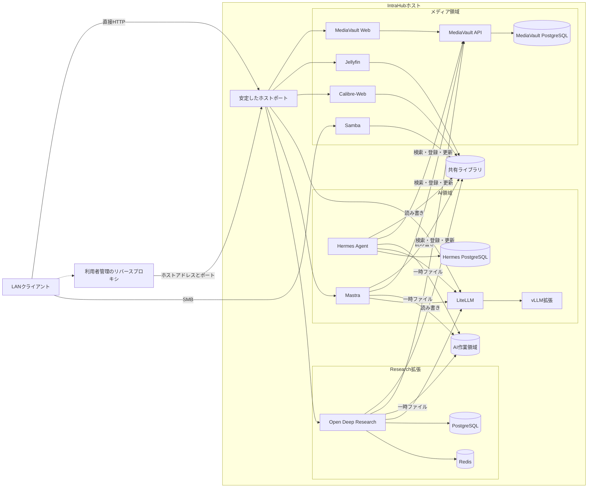

# IntraHub 再設計仕様

ステータス: 次期実装の目標設計。現存するComposeファイルは、まだこの仕様に準拠していない場合がある。

## 1. 目的

IntraHubは、メディア管理・LLM・エージェント関連のコンテナ群を、1台のLinuxホストで運用するDocker Composeプロジェクトである。

IntraHubが責任を持つ境界は、アプリケーションコンテナ、内部通信、永続データ、ホストの待ち受けアドレスとポートまでとする。DNS、ドメイン、TLS、リバースプロキシ、VPN、インターネット公開は利用者が管理する。

本設計は次を満たすことを目的とする。

1. 標準構成は、既存リバースプロキシ、外部Dockerネットワーク、GPU、ホスト固有の保存先がなくても起動できる。
2. Web/APIサービスは、安定したホストポートを通じて直接利用できる。
3. コンテナ定義を変更せず、Caddy、Traefik、nginx、Tunnelなどを前段に置ける。
4. 永続データは標準ではDocker named volumeを使い、任意の上書きでホストストレージへ移せる。
5. GPUや外部プロバイダなど、実環境に依存する機能は標準構成の起動を妨げない。
6. 未使用機能の変数、秘密情報、イメージ、デバイス、ディレクトリを要求しない。

## 2. 責務境界

### IntraHubが担当するもの

- アプリケーション、DB、キャッシュ、初期化コンテナ
- コンテナイメージとバージョン
- サービス間のプライベートネットワーク
- ホストへ公開する待ち受けアドレスとポート
- 永続ボリュームとコンテナ内パス
- コンテナが使用する設定と秘密情報
- ヘルスチェックと起動依存関係
- バックアップ／リストアの契約
- 構成検証とホストポート経由のスモークテスト

### IntraHubが担当しないもの

- FQDNとDNSレコード
- ホスト名／パスによるHTTPルーティング
- TLS証明書の発行と更新
- Caddy、Traefik、nginxなどのリバースプロキシ
- SSO、Forward Auth
- VPN、NAT、インターネット公開
- ホストファイアウォール
- 監視基盤

リバースプロキシの設定例は`examples/`へ置いてよいが、実行中のIntraHubプロジェクトには含めず、どのComposeファイルからも読み込まない。

## 3. 全体構成



共有ライブラリはメディア領域だけの所有物ではなく、メディアサービスとAIエージェントが共同利用するデータ境界とする。AI領域では、実際にファイル操作を行うMastra、Hermes、ODRへ読み書き可能でmountする。LLM APIの中継だけを行うLiteLLMとモデル推論だけを行うvLLMにはmountしない。

Mastra、Hermes、ODRはMediaVault APIの内部クライアントでもある。ファイル本体の読み書きには共有ライブラリを使い、MediaVaultが管理するメタデータ、索引、関連、処理状態の参照と更新にはAPIを使う。AIコンテナからMediaVaultのPostgreSQLへ直接接続してはならない。

リバースプロキシは`192.168.1.20:8096`のようなホスト上のエンドポイントへ接続する。IntraHubのDockerネットワークへ参加する必要はない。この契約により、プロキシはホストプロセス、別Composeプロジェクト、別サーバーのいずれにも配置できる。

## 4. Composeの階層

標準構成と実環境依存の拡張を、別のComposeファイルへ分離する。

| ファイル | 責務 | 必要な実環境条件 |
|---|---|---|
| `compose.yaml` | CPUで動く標準コンテナ、内部ネットワーク、named volume、ホストポート | Docker EngineとComposeのみ |
| `compose.storage.yaml` | 永続ボリュームをホストディレクトリへ変更 | 作成済みで書き込み可能なディレクトリ |
| `compose.gpu.yaml` | vLLMとGPU予約を追加 | NVIDIA GPUとContainer Toolkit |
| `compose.research.yaml` | Researchコンテナ群を追加 | pull可能なODRイメージと必要なプロバイダ設定 |
| `compose.local.yaml` | 利用者固有の上書き。gitignore対象 | 利用者定義 |

標準ファイルからGPUとResearchの定義を読み込んではならない。Composeはprofileを適用する前に変数展開するため、profileだけでは実環境依存の変数や秘密情報を隔離できない。

標準構成:

```sh
docker compose up -d
```

ホストストレージを使う構成:

```sh
docker compose -f compose.yaml -f compose.storage.yaml up -d
```

GPUを使う構成:

```sh
docker compose -f compose.yaml -f compose.gpu.yaml up -d
```

すべての拡張を使う構成:

```sh
docker compose \
  -f compose.yaml \
  -f compose.storage.yaml \
  -f compose.gpu.yaml \
  -f compose.research.yaml \
  up -d
```

利用者は利便性のため`.env`へ`COMPOSE_FILE`を書いてよいが、リポジトリの動作要件にはしない。ドキュメントとCIでは、対象ファイルを明示した再現可能なコマンドを使う。

## 5. 目標ディレクトリ構成

```text
intrahub/
├── compose.yaml
├── compose.storage.yaml
├── compose.gpu.yaml
├── compose.research.yaml
├── .env.example
├── README.md
├── services/
│   ├── mediavault/
│   │   ├── compose.yaml
│   │   ├── config/
│   │   │   └── *.example
│   │   └── README.md
│   ├── jellyfin/
│   │   ├── compose.yaml
│   │   └── README.md
│   ├── calibre-web/
│   │   ├── compose.yaml
│   │   └── README.md
│   ├── samba/
│   │   ├── compose.yaml
│   │   ├── config/
│   │   │   └── smb.conf.example
│   │   └── README.md
│   ├── bookmarks/
│   │   ├── compose.yaml
│   │   ├── config/
│   │   │   └── config.yml.example
│   │   └── README.md
│   ├── litellm/
│   │   ├── compose.yaml
│   │   ├── config/
│   │   │   └── config.yaml.example
│   │   └── README.md
│   ├── mastra/
│   │   ├── compose.yaml
│   │   └── README.md
│   ├── hermes-agent/
│   │   ├── compose.yaml
│   │   └── README.md
│   ├── vllm/
│   │   ├── compose.yaml
│   │   └── README.md
│   └── open-deep-research/
│       ├── compose.yaml
│       └── README.md
├── runtime/                     # bootstrapが生成。全体をgitignore
│   ├── config/
│   │   ├── mediavault/
│   │   ├── samba/
│   │   │   └── smb.conf
│   │   ├── bookmarks/
│   │   │   └── config.yml
│   │   └── litellm/
│   │       └── config.yaml
│   └── secrets/
│       ├── mediavault/
│       ├── bookmarks/
│       ├── litellm/
│       ├── hermes/
│       └── research/
├── scripts/
│   ├── bootstrap.sh
│   ├── validate.sh
│   ├── smoke-test.sh
│   ├── backup.sh
│   └── restore.sh
├── examples/
│   └── reverse-proxy/
│       ├── Caddyfile.example
│       └── README.md
└── docs/
    ├── architecture.md
    ├── configuration.md
    ├── operations.md
    ├── storage.md
    └── security.md
```

`services/<name>/compose.yaml`には実環境に依存しないコンテナ契約だけを書く。`services/<name>/config/`にはバージョン管理する設定テンプレートを置き、実値を含む設定は`runtime/`へ生成する。ホストの機能や物理配置に関する差分はルートの追加Composeファイルへ置く。

## 6. 標準構成の移植性契約

`compose.yaml`と、それが読み込む全サービスは次を満たさなければならない。

- ホストパスを要求しない。
- 外部Dockerネットワークを要求しない。
- GPUデバイスを要求しない。
- ローカルでのイメージビルドを要求しない。
- 対応ホスト向けにpull可能なイメージだけを参照する。
- ブラウザ／APIサービスは安定したホストポートを持つ。
- 公開ポートは`${BIND_ADDRESS:-127.0.0.1}`へbindする。
- DB、Redis、内部API、モデルバックエンドはホストポートを持たない。
- 永続データはnamed volumeへ置く。
- メディアサービスとAIエージェントは同じ`shares` volumeを、同じコンテナ内パス`/library`で共有する。
- Mastra、Hermes、ODRは内部Dockerネットワーク上のMediaVault APIを名前解決できる。
- ドメイン、公開URL、TLS設定に依存しない。アプリがoriginを必須とする場合だけ、直接アクセスポートを使った安全な既定値を与える。
- ローカルで生成できる秘密情報は`scripts/bootstrap.sh`が生成する。安全でない固定値をリポジトリに持たない。
- 外部プロバイダの認証情報は標準構成の起動条件にしない。必須になるサービスは拡張ファイルへ分離する。

サポート対象は、Docker Engineと現行Docker Composeプラグインを備えたLinuxホストとする。「実環境に関わらず」は、DNS、プロキシ、ストレージ配置、GPU、未使用連携の認証情報に依存しないことを指し、Linuxコンテナランタイムへの非依存を意味しない。

## 7. ホストポート契約

ホストポートはIntraHubの安定した公開APIとする。

| サービス | 既定ホストポート | 転送先 | 用途 |
|---|---:|---:|---|
| MediaVault | 8080 | `mediavault-web:80` | HTTP |
| Bookmarks | 8082 | `bookmarks:80` | HTTP/WebDAV |
| Calibre-Web | 8083 | `calibre-web:8083` | HTTP |
| Jellyfin | 8096 | `jellyfin:8096` | HTTP/WebSocket |
| LiteLLM | 4000 | `litellm:4000` | HTTP API |
| Mastra | 4111 | `mastra:4111` | HTTP/WebSocket |
| Open Deep Research | 8000 | `open-deep-research:8000` | HTTP、拡張のみ |
| Samba | 445 | `samba:445` | SMB |

ポートはサービスごとに変更できるが、リリース間で既定値を変えない。変数名は`JELLYFIN_PORT`のように`<SERVICE>_PORT`へ統一する。

標準の待ち受けはループバックに限定する。

```dotenv
BIND_ADDRESS=127.0.0.1
```

利用者は次のいずれかを選ぶ。

1. ホスト上のプロキシ: `127.0.0.1`のまま、ループバックポートへ転送する。
2. LAN上またはコンテナ内のプロキシ: `192.168.1.20`のようなサーバーのLANアドレスを明示する。
3. LANから直接利用: LANアドレスへbindし、ホストファイアウォールで到達元を制限する。

`0.0.0.0`は許可するが推奨値にしない。アプリ自身に認証がないサービスをループバック外へbindする場合は、利用者が明示的にセキュリティ判断を行う。

## 8. リバースプロキシ連携

IntraHubはCaddyサービス、proxy用Dockerネットワーク、ドメイン変数、TLSモードを持たない。

Caddyの設定例:

```caddyfile
mediavault.home.example {
    reverse_proxy 192.168.1.20:8080
}

jellyfin.home.example {
    reverse_proxy 192.168.1.20:8096
}
```

Caddyが同じホストのコンテナで動く場合は、ホストのLANアドレスへ転送できる。別案として、Caddy側のComposeで`host.docker.internal`を`host-gateway`へ割り当て、到達可能なホストアドレスへbindされたポートを使ってよい。どちらの場合もIntraHubのDockerネットワークは変更しない。

各サービスのドキュメントには次を記載する。

- schemeと既定ポート
- ヘルスチェックのパス
- WebSocket転送の要否
- upload/body sizeの要件
- 推奨proxy timeout
- アプリ自身の認証の有無
- Forwarded Headerや外部origin設定の要否

これをリバースプロキシ連携の正式な契約とし、プロキシ製品別の設定は参考例とする。

## 9. 内部ネットワーク

ネットワークは製品分類ではなく、信頼境界で分ける。

| ネットワーク | 参加コンテナ | 目的 |
|---|---|---|
| `mediavault-api` | MediaVault Web、API、Mastra、Hermes、ODR | WebとAIクライアントからAPIへの通信 |
| `media-db` | MediaVault API、PostgreSQL | DBの隔離 |
| `llm-api` | LiteLLM、Mastra、Hermes、ODR、任意のvLLM | 内部LLM APIバス |
| `hermes-db` | Hermes、専用PostgreSQL | DBの隔離 |
| `research-data` | ODR、専用PostgreSQL、Redis | Research状態の隔離 |

必要なコンテナだけをネットワークへ参加させる。DBを公開Webフロントエンドと同じネットワークへ置かない。

ネットワーク名はComposeプロジェクトのスコープに保つ。外部拡張が参加する明確な要件がない限り、`name:`でグローバル名を付けない。これにより、同一ホストで複数のIntraHubを起動でき、他プロジェクトとの衝突を防げる。

### 9.1 MediaVault API契約

MediaVault APIはIntraHub内部の共有アプリケーションAPIである。ホストポートは公開せず、`mediavault-api`ネットワーク上で次のURLを使う。

```text
http://mediavault-api:8080
```

参加関係:

```yaml
services:
  mediavault-api:
    networks:
      - mediavault-api
      - media-db

  mediavault-web:
    networks:
      - mediavault-api

  mastra:
    networks:
      - mediavault-api
      - llm-api

  hermes-agent:
    networks:
      - mediavault-api
      - llm-api

networks:
  mediavault-api:
  media-db:
    internal: true
```

ODRを有効にした場合も、同じ`mediavault-api`ネットワークへ参加させる。LiteLLMとvLLMはMediaVaultを利用しないため参加させない。

AIクライアントへ渡す接続設定を統一する。

```dotenv
MEDIAVAULT_API_BASE_URL=http://mediavault-api:8080
```

認証はクライアントごとに識別できるサービス資格情報を原則とする。

```text
/run/secrets/mediavault-api-token-mastra
/run/secrets/mediavault-api-token-hermes
/run/secrets/mediavault-api-token-odr
```

MediaVault APIが個別tokenやscopeに未対応の場合だけ、移行期間中の互換策として共通内部tokenを使う。共通tokenを恒久設計にしてはならない。tokenには少なくとも次のscopeを設定できることを目標とする。

| scope | 操作 |
|---|---|
| `catalog:read` | メタデータ、索引、関連の検索・参照 |
| `catalog:write` | メタデータ、タグ、関連、処理状態の登録・更新 |
| `files:register` | 共有ライブラリに作成済みのファイルをMediaVaultへ登録 |
| `files:delete` | ファイルとカタログの削除。通常は付与しない |

標準ではMastra、Hermes、ODRへ`catalog:read`、`catalog:write`、`files:register`を用途に応じて付与し、`files:delete`は付与しない。

ファイルとAPIの責務を次のように分ける。

1. 大容量ファイルの読取り、生成、一時出力、atomic renameは`/library`で行う。
2. ファイルの確定後、AIクライアントがAPIへ相対パス、種類、由来、ハッシュ等を登録する。
3. メタデータ、タグ、関連、処理状態はAPI経由でのみ更新する。
4. MediaVaultのDBと内部ストレージ実装をAIコンテナへmountまたは公開しない。
5. API登録に失敗したファイルは`ai-work`へ戻すか再試行キューへ入れ、未登録のまま確定領域へ放置しない。

APIの一時的な停止でAIコンテナ自体を起動不能にしない。クライアントはタイムアウト、指数バックオフ、再試行上限を持ち、未完了ジョブを永続キューへ残す。Composeの`depends_on`は起動順序の補助に留め、可用性制御の代わりにしない。

MediaVault APIのサービスドキュメントは、APIバージョン、認証方法、scope、冪等性キー、エラー形式、rate limit、health/readiness endpointを公開契約として定義する。破壊的変更はAPIバージョンを分け、AIクライアントと独立して更新できるようにする。

## 10. 永続データ

### 10.1 標準モード

標準構成はdriver optionを持たないnamed volumeを宣言する。

```yaml
volumes:
  mediavault-db:
  mediavault-storage:
  shares:
  jellyfin-config:
  jellyfin-cache:
  calibre-config:
  litellm-data:
  mastra-data:
  hermes-db:
  hermes-pgdata:
  ai-workspace:
  bookmarks-data:
```

物理配置とボリューム作成をDockerに任せるため、標準構成はホスト固有の前提を持たない。

### 10.2 ホストストレージモード

`compose.storage.yaml`はボリュームの実装だけを変更し、サービスを再定義しない。

```yaml
volumes:
  shares:
    driver_opts:
      type: none
      o: bind
      device: ${LIBRARY_ROOT:?LIBRARY_ROOT is required}

  mediavault-storage:
    driver_opts:
      type: none
      o: bind
      device: ${DATA_ROOT:?DATA_ROOT is required}/mediavault/storage

  ai-workspace:
    driver_opts:
      type: none
      o: bind
      device: ${DATA_ROOT:?DATA_ROOT is required}/ai/workspace

  vllm-cache:
    driver_opts:
      type: none
      o: bind
      device: ${MODEL_CACHE_ROOT:?MODEL_CACHE_ROOT is required}
```

ボリュームごとの変数を増やさず、用途別の3つのルートを使う。

```dotenv
DATA_ROOT=/srv/intrahub
LIBRARY_ROOT=/mnt/library
MODEL_CACHE_ROOT=/mnt/nvme/vllm
```

- `DATA_ROOT`: DBとアプリケーション状態
- `LIBRARY_ROOT`: 動画、写真、書籍、Vaultなどのユーザーデータ
- `MODEL_CACHE_ROOT`: 再取得可能だが大容量なモデルキャッシュ

各ルート以下のレイアウトはリポジトリ側で固定する。完全に独自の配置が必要な利用者は、共通設計へ環境変数を追加せず、gitignoreされた`compose.local.yaml`で上書きする。

Composeのbind volumeに指定する`device`は、コンテナ作成前に存在する必要がある。`scripts/bootstrap.sh --storage`がディレクトリを作成し、必要な最上位ディレクトリだけに所有権を設定する。既存のメディアライブラリへ再帰的な`chown`を実行してはならない。

### 10.3 データ分類

| 分類 | 例 | バックアップ方針 |
|---|---|---|
| DB | PostgreSQL | 論理dump。稼働中のファイルコピーへ依存しない |
| アプリ状態 | 設定、SQLite、Bookmarks | 必要に応じてサービスを静止して取得 |
| ユーザーライブラリ | 動画、書籍、写真、Vault | 一次データとして保護 |
| キャッシュ | Jellyfin cache、vLLM model cache | 対象外。再生成可能 |
| ログ | 任意のアプリログ | 保持期間を制限し、災害復旧対象にしない |

### 10.4 AI領域との共有ライブラリ契約

共有ライブラリは`shares` volumeを唯一の正とし、メディア領域とAI領域で同じvolumeを読み書きする。コンテナごとの複製volumeや同期用コピーを作らない。named volumeからbind volumeへ変更しても、コンテナ内パスとアクセス契約は変えない。

標準レイアウト:

```text
/library/
├── inbox/          # Sambaや自動取込による入力
├── video/          # 動画原本
├── photo/          # 写真原本
├── books/          # 書籍・Calibreライブラリ
├── manga/          # マンガ
├── documents/      # PDF等の文書
├── vault/          # ナレッジ・ノート
├── ai-work/        # AI処理中の成果物
└── ai-output/      # AIが確定した成果物
```

AIコンテナの標準mount契約:

```yaml
services:
  hermes-agent:
    volumes:
      - type: volume
        source: shares
        target: /library
      - ai-workspace:/workspace
```

| コンテナ | mount | 標準権限 |
|---|---|---|
| Samba | `/library` | 読み書き |
| MediaVault API／Worker | `/library` | 読み書き |
| Jellyfin | `/library/video`、`/library/photo` | 読み取り専用 |
| Calibre-Web | `/library/books` | 運用要件に応じて読み書き。閲覧専用なら読み取り専用 |
| Mastra | `/library` | 読み書き |
| Hermes Agent | `/library` | 読み書き |
| Open Deep Research | `/library` | 読み書き |
| LiteLLM | mountしない | なし |
| vLLM | mountしない | なし |

`/workspace`は再生成可能な作業領域として残す。AIは大きな一時ファイル、ダウンロード途中のデータ、失敗したジョブの中間状態を`/workspace`へ置き、共有すべき入力と確定成果物だけを`/library`へ置く。

「AI領域が読み書きする」ことを、AI領域の全コンテナへvolumeを渡す意味にはしない。ファイル操作を責務に持つサービスだけへmountする。

共有ライブラリへ書き込むコンテナは共通の数値UID/GIDとumaskを使う。

```dotenv
LIBRARY_UID=1000
LIBRARY_GID=1000
LIBRARY_UMASK=0002
```

イメージに応じて`user:`、`PUID`／`PGID`、またはアプリ固有設定へ同じ値を渡す。ファイルとディレクトリはグループ書き込み可能とし、Sambaが作成したファイルをAIが更新でき、AIが作成した成果物をSambaやメディアサービスが参照できる状態を保つ。

同時更新と中途半端な成果物の露出を防ぐため、AIの書き込みは次の規則に従う。

1. 処理中の共有成果物は`/library/ai-work/<job-id>/`へ書く。
2. 完成後、同一filesystem内のrenameで`/library/ai-output/`または目的のカテゴリへ移す。
3. 原本を更新する場合は一時ファイルへ完全に出力してからatomic renameする。
4. 複数ワーカーが同じ論理資源を更新する場合は、アプリのジョブロックまたはDB上の排他制御を使う。
5. 削除や破壊的な一括更新はアプリ側で明示的な操作として扱い、監査ログを残す。
6. モデルキャッシュや再生成可能な中間データを`shares`へ置かない。

named volumeモードでは、冪等な初期化処理が初回起動時にカテゴリディレクトリと所有権を作る。ホストストレージモードでは`bootstrap.sh --storage`が同じ処理を行う。どちらも既存ファイルへ再帰的な所有権変更を行わない。

## 11. 設定と秘密情報

コンテナに関係するファイルを、性質ごとに4層へ分ける。

| 種類 | 配置 | Git管理 | 例 |
|---|---|---|---|
| Compose定義 | `services/<name>/compose.yaml` | する | image、port、network、volume、healthcheck |
| 設定テンプレート | `services/<name>/config/*.example` | する | LiteLLMのrouting、Samba共有、Bookmarks設定 |
| 実行時設定 | `runtime/config/<name>/` | しない | 実際にmountする`config.yaml`、`smb.conf` |
| 秘密情報 | `runtime/secrets/<name>/` | しない | DB password、API token、外部API key |
| アプリ生成状態 | named volumeまたはstorage override | しない | DB、SQLite、Jellyfin設定、キャッシュ |

### 11.1 Compose定義

各コンテナの実行仕様は`services/<name>/compose.yaml`を正とする。次を別の文書や`.env`へ重複して定義しない。

- イメージ名とバージョン
- コンテナ内ポート
- コンテナ内の設定／データパス
- networkとvolumeの参加関係
- healthcheck
- security option、UID/GID、capability

### 11.2 バージョン管理する設定

秘密情報や実環境値を含まない設定テンプレートは、対象サービスの隣に置く。

```text
services/litellm/config/config.yaml.example
services/samba/config/smb.conf.example
services/bookmarks/config/config.yml.example
```

テンプレートはアプリの設定schemaと共にバージョン管理され、イメージ更新時の設定変更も同じcommitで追跡できる。テンプレートをコンテナへ直接mountしない。

### 11.3 利用者が編集する実行時設定

`scripts/bootstrap.sh`がテンプレートを基に`runtime/config/<name>/`を生成し、初期値を展開する。通常はテンプレートのコピーだが、LiteLLMのように有効なproviderだけを含める必要がある設定は、選択内容に応じて未設定項目を除外して生成する。利用者が編集するのは生成後のファイルである。

```text
runtime/config/litellm/config.yaml
runtime/config/samba/smb.conf
runtime/config/bookmarks/config.yml
```

Composeはリポジトリからの相対パスで、必要なファイルだけを読み取り専用mountする。

```yaml
services:
  litellm:
    volumes:
      - ./runtime/config/litellm/config.yaml:/app/config.yaml:ro

  samba:
    volumes:
      - ./runtime/config/samba/smb.conf:/etc/samba/smb.conf:ro
```

標準配置をリポジトリ配下の`runtime/`に固定することで、`CONFIG_ROOT`のようなホスト固有の必須変数を増やさない。設定を別の場所で管理したい利用者は、gitignore対象の`compose.local.yaml`でmount元だけを上書きする。

`runtime/config/`の既存ファイルをbootstrapが無断で上書きしてはならない。テンプレート更新時は差分を表示し、利用者がmergeできるようにする。各実行時設定には、元にしたテンプレートまたは設定schemaのバージョンをコメントか隣接manifestへ記録する。

### 11.4 秘密情報

秘密情報は`runtime/secrets/<name>/`へ1項目1ファイルで置き、パーミッションを所有者読み取り専用にする。

```text
runtime/secrets/mediavault/postgres-password
runtime/secrets/mediavault/internal-api-key
runtime/secrets/mediavault/api-token-mastra
runtime/secrets/mediavault/api-token-hermes
runtime/secrets/litellm/master-key
runtime/secrets/hermes/postgres-password
```

イメージが対応する場合はCompose secretsとして`/run/secrets/<name>`へmountする。

```yaml
services:
  mediavault-api:
    secrets:
      - mediavault-internal-api-key

secrets:
  mediavault-internal-api-key:
    file: ./runtime/secrets/mediavault/internal-api-key
```

環境変数しか受け取れないイメージでは、entrypointでsecret fileを読み取ってプロセスへ渡す方法を優先する。それも困難な場合だけ、秘密情報を環境変数として渡す例外をサービスドキュメントへ記載する。

`runtime/`全体を`.gitignore`対象とし、秘密情報ファイルは`0600`、ディレクトリは`0700`を標準とする。バックアップでは暗号化対象にする。

### 11.5 アプリが生成する設定と状態

JellyfinやCalibre-Webのように、管理画面や実行時処理によって設定を生成するアプリでは、その設定を`runtime/config/`へ手作業で置かない。アプリ固有の永続volumeへ保存する。

| サービス | 主な生成状態 | 保存先 |
|---|---|---|
| MediaVault PostgreSQL | DB | `mediavault-db` volume |
| Jellyfin | サーバー設定、ユーザー、ライブラリDB | `jellyfin-config` volume |
| Jellyfin | 再生成可能なcache | `jellyfin-cache` volume |
| Calibre-Web | アプリ設定 | `calibre-config` volume |
| Mastra | SQLite等のアプリ状態 | `mastra-data` volume |
| Hermes | アプリ状態、DB | `hermes-db`、`hermes-pgdata` volume |
| Bookmarks | WebDAVデータ | `bookmarks-data` volume |

設定ファイルとアプリ状態を同じ場所へ混在させない。バックアップ時は、`runtime/config`、`runtime/secrets`、DB、アプリ状態をそれぞれの整合性要件に従って取得する。

### 11.6 `.env`の役割

`.env`はComposeが使う実際のデプロイ入力だけを持ち、利用可能な全連携の一覧にはしない。

```dotenv
TZ=UTC
BIND_ADDRESS=127.0.0.1

MEDIAVAULT_PORT=8080
BOOKMARKS_PORT=8082
CALIBRE_PORT=8083
JELLYFIN_PORT=8096
LITELLM_PORT=4000
MASTRA_PORT=4111
ODR_PORT=8000
SAMBA_PORT=445
```

規則:

- 安全で移植可能な既定値はComposeの変数展開へ置く。
- 秘密情報にリポジトリ既定値を持たせない。
- 1つの秘密情報は1か所だけを正とする。
- ローカル秘密情報は`bootstrap.sh`が暗号学的に安全な乱数で生成する。
- 同じ値を`.env`とアプリ設定ファイルへ重複して書かせない。
- 拡張固有の変数は拡張固有のexampleへ置き、標準構成から要求しない。
- `${VAR:?}`は、その変数を必要とするComposeファイルを利用者が明示的に選んだ場合だけ使う。

イメージがファイル形式の秘密情報をサポートする場合はCompose secretsを優先する。環境変数しか受け取れないイメージでは、互換性のため明示的に例外とする。

### 11.7 LiteLLMのプロバイダ切り替え

LiteLLMにはAnthropicとOpenAIの両方を登録する。変数名は`ANTHROPIC_API_KEY`と`OPENAI_API_KEY`とする。`OPENAPI_API_KEY`という名前は使用しない。

プロバイダの実モデルIDは秘密情報ではないため`.env`へ置く。

```dotenv
ANTHROPIC_MODEL=anthropic/<利用するモデルID>
OPENAI_MODEL=openai/<利用するモデルID>
```

APIキーとLiteLLMへのクライアント認証キーは別の秘密ファイルとして管理する。

```text
runtime/secrets/litellm/anthropic-api-key
runtime/secrets/litellm/openai-api-key
runtime/secrets/litellm/master-key
```

役割:

| 秘密情報 | 用途 |
|---|---|
| `anthropic-api-key` | LiteLLMからAnthropic APIへの認証 |
| `openai-api-key` | LiteLLMからOpenAI APIへの認証 |
| `master-key` | Mastra、Hermes、ODR等からLiteLLMへの認証 |

設定テンプレートは`services/litellm/config/config.yaml.example`、利用者が実際に変更するファイルは`runtime/config/litellm/config.yaml`とする。YAMLには秘密情報を直書きせず、LiteLLMの環境変数参照形式を使う。

```yaml
model_list:
  - model_name: anthropic
    litellm_params:
      model: os.environ/ANTHROPIC_MODEL
      api_key: os.environ/ANTHROPIC_API_KEY

  - model_name: openai
    litellm_params:
      model: os.environ/OPENAI_MODEL
      api_key: os.environ/OPENAI_API_KEY

general_settings:
  master_key: os.environ/LITELLM_MASTER_KEY
```

`anthropic`と`openai`はIntraHub内部の安定した論理モデル名である。実際のプロバイダモデルIDを変更しても、AIクライアントの接続先と認証方法は変えない。

Mastra、Hermes、ODRはOpenAI互換APIの`model`フィールドで明示的に切り替える。

```json
{
  "model": "anthropic",
  "messages": [{"role": "user", "content": "..."}]
}
```

または:

```json
{
  "model": "openai",
  "messages": [{"role": "user", "content": "..."}]
}
```

クライアントごとの通常利用モデルは、クライアント側の非秘密設定で決める。

```dotenv
MASTRA_LLM_MODEL=anthropic
HERMES_LLM_MODEL=openai
ODR_LLM_MODEL=anthropic
```

この値を変えて対象クライアントを再起動すれば、コードやLiteLLMのURLを変更せずにプロバイダを切り替えられる。ジョブ単位でモデルを選べるクライアントでは、リクエストごとの切り替えも許可する。

自動fallbackは手動切り替えと別の機能として扱う。導入する場合は、使用するLiteLLMの固定バージョンでfallback構文と対象エラーを検証し、意図しない高額モデルへの切り替えを防ぐ予算上限を設定する。標準設計では、明示的に指定された`anthropic`または`openai`を勝手に別プロバイダへ変更しない。

標準構成の移植性を保つため、プロバイダキーがないこと自体でLiteLLMコンテナを起動不能にしない。`bootstrap.sh`は存在するキーに対応するproviderだけを実行時設定へ展開する。両方のキーが設定された環境では両方を公開し、片方だけの環境では設定済みproviderだけを公開する。`validate.sh`は、クライアントが選択した論理モデルに対応するproviderが存在することを検査する。

## 12. 実環境依存の拡張

### GPU

vLLMは`compose.gpu.yaml`だけに定義する。標準のLiteLLMはvLLMがなくても起動しなければならない。利用可能な外部ルートがない場合でも、少なくとも設定可能な状態で正常起動し、依存先不在をヘルスチェック失敗として扱わない。

GPU拡張は、検証スクリプトが次を確認した場合だけ有効とする。

- NVIDIAドライバが利用できる
- Container Toolkitが構成済み
- 要求したGPUが存在する
- モデルキャッシュへコンテナUIDで書き込める
- gated modelを使う場合のトークンが存在する

### Research

Open Deep Researchは次をすべて満たすまで`compose.research.yaml`だけに置く。

- ローカルbuild不要でpull可能なイメージが存在する
- 文書化されたプロバイダ設定で起動できる
- RedisとPostgreSQLにヘルスチェックがある
- 秘密情報が標準構成から隔離されている

未実装サービスをコメントアウトしたComposeブロックや、到達不能な公開設定として残さない。イメージ、設定契約、ヘルスチェック、ドキュメントが揃った時点で追加する。

## 13. コンテナ定義の標準

各常駐サービスは、イメージ上の制約がない限り次を満たす。例外はサービスドキュメントへ理由を記載する。

- `latest`を使わず、イメージのバージョンを固定する。
- `restart: unless-stopped`を使う。
- `container_name`を指定せず、Compose DNSのサービス名を使う。
- 対応している場合は非rootで実行する。
- `no-new-privileges:true`を設定する。
- 不要なLinux capabilityをdropする。
- 読み取りしか必要としないコンテナでは、原本データと静的設定を読み取り専用でmountする。
- 共有ライブラリへ書き込むサービスは共通の`LIBRARY_UID`／`LIBRARY_GID`を使い、書き込み対象と原本保護の方針を文書化する。
- Docker socketを直接mountしない。将来必要になった場合は権限制限したsocket proxyを使う。
- 単なるプロセス存在確認ではなく、サービス機能を確認するhealthcheckを持つ。
- `depends_on`のreadiness条件は、本当に起動順序を必要とする依存だけに使う。
- Docker logging driverまたはホスト方針でログローテーションする。
- メモリ使用量の大きいサービスは予約値／上限とサイジングを文書化する。

one-shot初期化サービスは、`bootstrap.sh`やイメージ自身で初期化できない場合だけ許可する。処理は冪等で、`restart: "no"`とする。

## 14. 初期構築と検証

目標とする初期構築手順:

```sh
cp .env.example .env
./scripts/bootstrap.sh
./scripts/validate.sh
docker compose up -d
./scripts/smoke-test.sh
```

`validate.sh`はコンテナ群を起動せず、次を確認する。

- DockerとComposeのバージョン
- Composeの変数展開とmerge結果
- `runtime/config`に必要な設定ファイルが存在し、テンプレートschemaと互換であること
- 必須秘密ファイル
- `runtime/secrets`のファイル／ディレクトリ権限
- ホストポートの競合
- 選択した拡張の前提条件
- storage上書き時のディレクトリと権限
- `shares`を読み書きする全コンテナのUID/GIDとumaskの整合性
- Mastra、Hermes、有効時のODRからMediaVault APIを名前解決・認証できること
- AIコンテナからMediaVault PostgreSQLへ接続できないこと
- LiteLLMに設定された`anthropic`／`openai`の各論理モデルと、対応するAPI keyの組み合わせ
- Mastra、Hermes、ODRが選択する論理モデルがLiteLLMの`model_list`に存在すること
- DB、Redis、内部APIにホストポートがないこと
- 標準構成に可変タグ、ローカルbuild、ホスト固有パスがないこと

`smoke-test.sh`はhealthcheckの完了を待ち、有効な全公開エンドポイントをホストポート経由で検査する。DNSやリバースプロキシを必要としない。

## 15. バックアップとリストア

リポジトリはアプリケーション状態のバックアップ／リストア手順を提供するが、オフサイト保管製品までは内包しない。

- PostgreSQLは`pg_dump`で取得する。
- Redisは使い方に応じて使い捨てまたは公式のsnapshot手順で保護する。
- SQLiteとアプリ状態は、整合性が必要な場合にサービスを静止する。
- ユーザーライブラリはバックアップ対象一覧へ含めるが、restic、borg、スナップショット等へ実処理を委譲してよい。
- キャッシュは除外する。

DBのmajor versionまたは永続レイアウトを変更するリリースには、移行手順とrollback手順を必須とする。

## 16. 受け入れ条件

再設計の実装完了条件を次のように定める。

1. 新しいサポート対象Linuxホストで、`bootstrap.sh`、`validate.sh`、`docker compose up -d`により、ドメイン、リバースプロキシ、外部ネットワーク、GPU、bind先なしで標準構成が起動する。
2. 全公開サービスが`127.0.0.1:<既定ポート>`で到達可能になり、スモークテストを通る。
3. `BIND_ADDRESS`を明示的なLANアドレスへ変更すると、サービス定義を変えずに外部管理のプロキシから到達できる。
4. `compose.storage.yaml`を追加すると、コンテナ内パスやアプリ設定を変えずに永続データが指定ルートへ移る。
5. 選択していない拡張が使う変数、秘密情報、イメージ、デバイス、ディレクトリを要求しない。
6. DB、Redis、内部API、モデルバックエンドがホストへ公開されない。
7. 実行時ComposeモデルにCaddy、TLS、DNS、FQDNの設定が存在しない。
8. Mastra、Hermes、ODRが共有ライブラリを`/library`で読み書きでき、Sambaとの間で所有権エラーが起きない。
9. LiteLLMとvLLMには共有ライブラリがmountされない。
10. AIの処理中ファイルが完成ファイルとして他サービスへ露出せず、atomic renameによる確定処理を検証できる。
11. Mastra、Hermes、有効時のODRが内部URLでMediaVault APIを利用できる。
12. AIコンテナはMediaVault PostgreSQLへ到達できず、メタデータ更新がAPI経由に限定される。
13. AIが共有ライブラリへ確定したファイルを、冪等なAPI呼び出しでMediaVaultへ登録できる。
14. `bootstrap.sh`が必要な実行時設定と秘密情報を`runtime/`へ作成し、既存設定を上書きしない。
15. 実行時設定、秘密情報、アプリ生成状態が規定された別々の場所へ保存される。
16. 両方のprovider keyがある場合、同じLiteLLM URLに対して`model: anthropic`と`model: openai`のリクエストが成功する。
17. 片方のprovider keyだけの場合もLiteLLMが起動し、設定済みproviderだけを公開する。
18. CIで標準構成とサポート対象の全Compose組み合わせに`docker compose config`と規約検証を実行する。

## 17. 実装順序

1. `.env.example`を標準構成に必要な項目だけで再作成する。
2. `compose.yaml`と各サービス断片を移植性契約に従って再作成する。
3. `compose.bind.yaml`を、データ分類に基づく`compose.storage.yaml`へ置き換える。
4. vLLMとODRを追加Composeファイルへ隔離する。
5. bootstrap、構成検証、ホストポート経由のスモークテストを実装する。
6. アプリケーションを考慮したbackup／restoreを実装する。
7. 実行時依存を増やさず、リバースプロキシの参考例を追加する。
8. サポートする全Compose組み合わせのCI検証を追加する。
