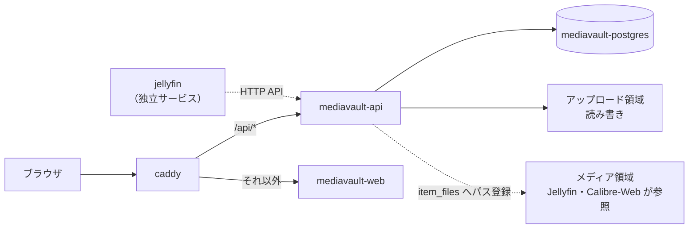

← [intrahub/README.md](../../README.md)

# MediaVault

映画・アニメ・マンガ・小説・ゲーム・論文などのメタデータとファイル情報を一元管理する自作アプリ。PostgreSQL を正本とし、Web UI と HTTP API から操作する。

**閲覧ビューアは持たない。** 動画は Jellyfin、マンガ・書籍は Calibre-Web が担当し、MediaVault は `item_links` を基に別タブで開く導線を出すだけとする。この分離により、Jellyfin と Calibre-Web は MediaVault が停止していても単独で動く。

## 原則

| # | 原則 |
|---|---|
| 1 | メタデータの正本は `mediavault-api` が管理する PostgreSQL とする |
| 2 | すべての変更を公開API経由に統一する。他コンテナから DB へ直接書かない |
| 3 | 既存ファイルは移動もマウントもせず、`item_files` のパスから参照する |
| 4 | API経由のアップロードだけを MediaVault 専用領域へ保存する |
| 5 | 動画は Jellyfin、マンガ・書籍は Calibre-Web で閲覧する |
| 6 | 個別コンテナのホストポートを公開せず、HTTP入口を Caddy へ集約する |
| 7 | worker / mcp が停止していても api / web の基本機能を使える構成にする |

## データモデルと認証

| 区分 | 主なデータ |
|---|---|
| 正本 | `items`（正準キーは `items.id`） |
| 分類 | tags、categories、staff、cast、mylists |
| ファイル | `item_files` |
| 外部参照 | item links、streaming links、trailers |
| 構造 | groups、episodes、relations |
| 拡張 | knowledge、jobs |

エンドポイントとレスポンスの詳細は `intrahub-mediavault` リポジトリの `docs/backend/mediavault-api/` を正とし、本文書へ複製しない。

**公開APIはログイン機構を持たない。** 単一ユーザーの LAN 内利用を前提とした割り切りで、その代わり LAN 境界と Caddy を越えて公開しない。`/internal/*` だけは `INTERNAL_API_KEY` の Bearer 認証で保護する。

## 閲覧サービスとの連携

| 対象 | サービス | 連携方式 |
|---|---|---|
| 動画 | Jellyfin | `mediavault-api` を呼ぶ（プラグイン経由） |
| マンガ・書籍 | Calibre-Web | `item_links` による MediaVault 側からの片方向参照のみ。Calibre-Web から API は呼ばない |

両者とも MediaVault の DB とアップロード領域へ直接アクセスしない。閲覧に必要なパス以外の要素（Jellyfin の外部視聴リンク、Calibre-Web の書誌ID等）は `item_links` として Item 側に持たせる。

Samba・Bookmarks は MediaVault から独立しており、このデータモデルには含めない。

## コンテナ構成

| コンテナ | 設計書 | 役割 |
|---|---|---|
| `mediavault-postgres` | [mediavault-postgres.md](./mediavault-postgres.md) | MediaVault 専用DB |
| `mediavault-api` | [mediavault-api.md](./mediavault-api.md) | 公開API、ファイル管理、起動時マイグレーション |
| `mediavault-web` | [mediavault-web.md](./mediavault-web.md) | 管理UI（SPA） |

`mediavault-worker`（非同期ジョブ）と `mediavault-mcp`（AIエージェント向けアダプタ）は未実装のため `compose.yaml` にコメントで待機している。



## 公開

| サブドメイン | 転送先 |
|---|---|
| `mediavault` | `/api/*` は `mediavault-api:8080`、それ以外は `mediavault-web:80` |

vhost の実体は [Caddy](../caddy/README.md#公開)。1つのFQDNをパスで分岐させるため、api と web を別サブドメインに分けない。`mediavault-postgres` はホストにもリバースプロキシにも公開しない。

認証は MediaVault 自身が持つ。Caddy では行わない。

## ネットワーク

| ネットワーク | 参加コンテナ | 用途 |
|---|---|---|
| `db-net` | `mediavault-postgres`, `mediavault-api` | DB接続。サービス内部に閉じる |
| `proxy-net` | `mediavault-api`, `mediavault-web` | Caddy からの到達 |

`mediavault-api` は `proxy-net` 上で `backend` というエイリアスも持つ。`mediavault-web` の nginx がその名前で upstream を引くためで、アプリリポジトリのローカル結合環境と本番で `nginx.conf` を分けずに済ませている。

## 入力変数

| 変数名 | 必須 | 秘密 | 用途 |
|---|---|---|---|
| `MEDIAVAULT_ROOT` | ○ | | アップロード領域と専用DBを置くホスト側パス |
| `TZ` | ○ | | コンテナのタイムゾーン |
| `POSTGRES_USER` / `POSTGRES_PASSWORD` / `POSTGRES_DB` | ○ | パスワードのみ○ | 専用DBの接続情報 |
| `INTERNAL_API_KEY` | ○ | ○ | `/internal/*` の Bearer 認証キー |
| `CORS_ALLOWED_ORIGIN` | ○ | | web を配信するオリジン。単一のみ |
| `TMDB_API_KEY` ほか外部メタデータAPI7種 | | ○ | 未設定のプロバイダは起動時 seed をスキップ |
| `LLM_BASE_URL` / `LLM_API_KEY` | | 鍵のみ○ | worker 用。worker 実装までは未使用 |

実値は `.env` に置く。ひな形は [.env.example](../../.env.example) の `# ---- mediavault ----` 節。

## ホスト配置

設定するデータパスは `MEDIAVAULT_ROOT` だけとし、配下の構成はアプリが作る。メディア領域（Jellyfin・Calibre-Web・Samba が参照する実データ）は**マウントしない** — 既存ファイルは `item_files` へ絶対パスを登録してリンクし、コピーも移動もしない。これにより、メディア領域にカテゴリを増やしても MediaVault 側の設定変更が要らない。

```
<MEDIAVAULT_ROOT>/
├── files/          # アップロードの実体。アイテムIDごとにディレクトリを切る
│   └── {item_id}/
└── db/             # mediavault-postgres のデータ
```

DB のデータを `db/` としてこのルート配下に置くのは、MediaVault の永続データを1か所へまとめてバックアップ単位を揃えるため。

## イメージの発行

`mediavault-api` / `mediavault-web` は自作アプリで、ソースは `intrahub-mediavault` リポジトリにある。イメージはそのリポジトリの CI が GHCR へ publish し、本リポジトリは `image:` でバージョンを固定して pull するだけとする（[自作サービスの実装](../../README.md#自作サービスの実装)）。本リポジトリでビルドはしない。

## 運用

| 項目 | 内容 |
|---|---|
| バックアップ対象 | `<MEDIAVAULT_ROOT>/db`（DBダンプ）、`<MEDIAVAULT_ROOT>/files`（アップロード実体） |
| バックアップ対象外 | メディア領域の実データ。MediaVault はパスを持つだけで実体を所有しないため、原本のバックアップはメディア領域側の責務 |
| マイグレーション | `mediavault-api` が起動時に自ら適用する。専用の migrate コンテナは持たない |

## 確認

| 確認項目 | コマンド | 合格条件 |
|---|---|---|
| API の起動 | `docker compose ps mediavault-api` | `healthy` になる |
| DB 接続 | `docker compose logs mediavault-api` | マイグレーション適用のログが出て、接続エラーが無い |
| Web UI | `curl -sI https://mediavault.<ドメイン>` | `200` |
| API 転送 | `curl -s https://mediavault.<ドメイン>/api/health` | 正常応答。`502` なら api が未起動 |
| DB の非公開 | `docker compose exec caddy wget -qO- http://mediavault-postgres:5432` | 名前解決できない（`proxy-net` にいない） |
